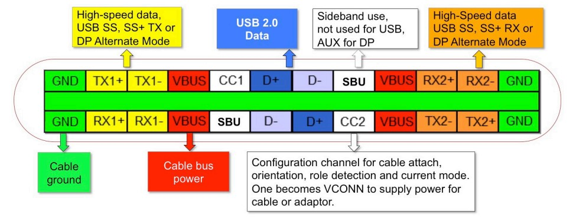

# [USB](https://github.com/Qful/USB)

## [USB C 简介](https://github.com/Qful/USB)

[USB](https://github.com/Qful/USB)项目通过将USB的一些特性单独整理成功能模块，保证相关技术和资源的复用，也便于各种工程集成后的维护和深度开发。

该为type-c接口的各种特性使用，包括PD和视频信号输出，通过DEMUX电路实现更多功能的集成和智能的选择使能，该单元是可编程控制单元，有自己的协议和相应的管理范围。

#### 开发工具及资源

* zadig
